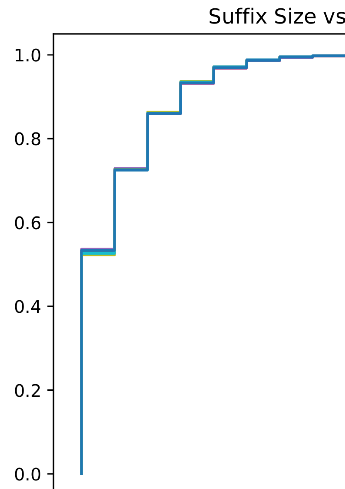

# Introduction

I'm trying to figure out how to get a hash table that does not use too much
memory, and can simultaneously work in remote memory. This is a hard problem,
and most prior work is aimed at either using huge amounts of memory Clover,
RACE, or they require memory side compute.

I had the idea of creating a hybrid of cuckoo hashing and hopscotch hashing. The
idea is that the two hashes of cuckoo hashing are dependent. The first hash
determines the neighbourhood that the key will be placed in the hash, and the
second hash determines an offset from the first where it can be bounced to. This
second feature is a bound on the distance between the location of any hashed
object.

# Locality Hashing Collisions

In my first experiment I created two hashes using the method described above and
set the bound to 32. I created three insertion functions. The first function just inserts to the primary location. The second is a blind insertion, it first checks if the location it wants is full. If it is full then it writes to the second. In the next case it uses the less crowded method. Less crowded chooses the hash location that has less in it.

In this experiment I have 5 lines. The first is the control which just inserts into the primary location. Blind insertion either runs with limitless bound or the bound of 32. Less crowded runs either on all location or on a bound. The takeaway from this experiment is that there does not seem to be a large difference between the boulded and unbounded methods at a range of 32.

# Blind Suffix

Here I measure the blind insertion technique across many suffix sizes. The takeaway is that the suffix does not seem to matter much if we are not making smart decisions.

# Less crowded bounded

Finally I ran the same experiment as above but using the less crowded heuristic.
Here the outcome is different. The size of the suffix is a clear indicator of
performance. Note that on these charts a collision count of 0 means no insert
occurred there. We want the value to be 1. Everything higher than 1 is bad
because it means there has been a collision.

