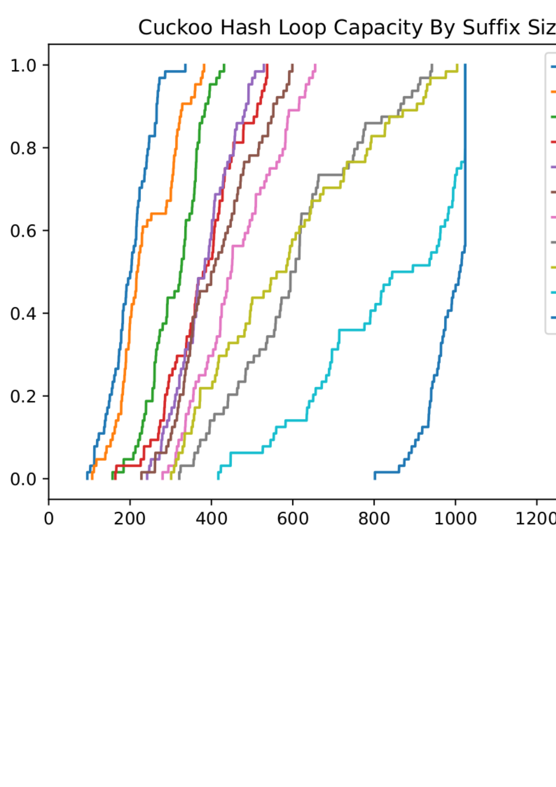

# Introduction

I decided to extend my notion of a bounded hash to cuckoo hashing. I followed a
tutorial online for how to build the cuckoo hash
[link](https://www.youtube.com/watch?v=GPiJUtdiUlo).  The code for this hash is
in the locality hash folder. The basic summary is that I insert to a location, if that location is unoccupied then I removed the occupied value and insert where the occupier was. I then rehash the occupier with a different hash and try the whole process again.

Cuckoo hashing does not allow for loops to occur. That is if I try to insert and
item, and I find myself back at the location I started at, then I"m doomed and
have to stop or rehash the table. The value is one that I measure, i.e how many inserts can I perform before we crash.

My concern in this set of experiments is to check if the second hash function being bounded effects the performance of the hash table. I also measure collisions.

# Basic Collisions

I started by testing the number of collisions that I would get if I bounded the space by 8.

Here there is almost no difference. An encouraging start. However I only filled the hash table halfway up here. The total number of slots is 2048 and I inserted 1024.

# How Full Can we go with a bound

In the following experiment I modify the bound just like I did in the prior experiments. This time I still only fill the hash table up to 1024 elements A load of half and just increase the suffix size.

