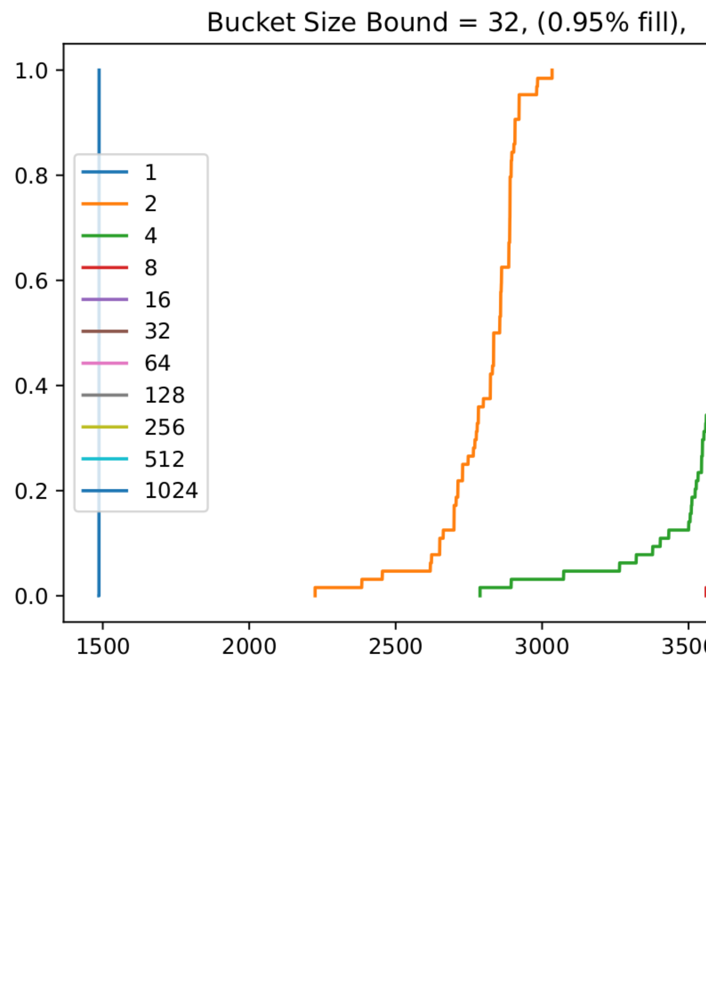
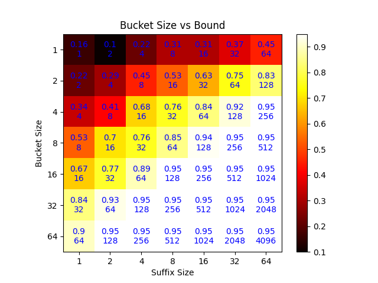

# Introduction

I was looking at other papers on cuckoo hashing. Basically none of them use the
default algorithm. They instead do bucketized cuckoo hashing. Bucketized cuckoo
hashing has a degree of associativity in each bucket. You hash to a bucket, and
then append to the location you want. If the bucket is full then you invoke the
cuckoo replacement. The projects I was looking at are
[memc3](https://www.usenix.org/conference/nsdi13/technical-sessions/presentation/fan),[horton
tables](https://www.usenix.org/conference/atc16/technical-sessions/presentation/breslow),
and [Cuckoo++](https://arxiv.org/abs/1712.09624).

The following is an image of a bucketized cuckoo hash from MemC3 

Also an example of the eviction path

# My approach

I built the hash table with associativity and have applied the same benchmarks as before to see if I can get my locality hash to work.

The big difference here is that with associativity I also get an eviction choice. I'm not doing anything smart to start with. I just choose a random value and begin the eviction process with it.

As before I checked the number of collisions.

This is not really a true test because I don't understand the effect of the
buckets. One thing that is clear, it's that the tail gets really big when I
start to have a bound, but it does not really effect the max efficiency of the
table.

## Suffix Size Experiment.

I set the level of associativity to 4 i.e 4 keys per bucket. Then I scaled up
the bound on the hash table. This time I made sure to inject 95% of the total
number of spaces. This is hard to compare to the prior experiments because I was
always below 50%. It's safe to say that the results in the bucket case are much
much better.

Here the trend is almost the same as before, but we are at around 95%. My next
question is how well do we do at lower loads.

# Fill Ratio Experiments

I set the fill ration to vary and ran many experiments. I've set the bucket size to 4 here, and the suffix size to 32.

Here we see an interesting result. The failure curve for each level of fill is the same. Somewhere around 4.7k aprox 50% of the fill we start to see loops on this suffix. However for the most part they do not seem to appear much below 80%. At around 80% however the values really start to peak.

# Basic Bucket size experiments

In the next step I played with two version of the bucket size and filled to 95%.
The first one I ran on a bound of 32 and the next I ran on a bound of 16. I increased the size of the buckets through each experiment.

This is a somewhat startling result. It seems that the associativity plays a
bigger role than the bound. Exactly what I was looking for. Here the bound of 16
has an effect, but less than in the prior cases.

# Parameter sweep

Finally I decided to do a sweep of bucket sizes and bound sizes to see what the association is.

This is really interesting. There seems to be a sweet spot, and the bound is not
insane. This chart is a little complicated so I'll break it down. The top number
in every square is the 50th percentile of where the inserts failed and created a
loop. Each trial was run 32 times. Dark reigons are bad, white is good. The
lower number is the size a read would have to be to ensure that a hashed item
was captured in a single round trip. I think that the most interesting case here
is 8x8. It appears that we get the most bang for our buck at this ratio. The
table is getting full, and we can perform a read by grabbing the nearest 64
blocks. I believe if we have 64 bit entries. This will be 512 bytes. Not the
highest price to pay for a saved round trip. The cost of course is memory
efficiency. We can do the same thing for 32 entries with a bucket size of 8, and
suffix size of 4.

One important thing to realize here is that the bigger the bucket is, the bigger
the overhead for common case reads. If we can lower the bucket size we get
faster common case reads.

# Additional Notes (important)

First, these reads do not need to cost the max amount. The Distance shown is the
max distance. The client does not need to use this, it can read the exact amount
required for any key. Why? because it will have the hashes available to it.
ReadLocation = Hash_1(key), Readsize = Hash_2(key) - Hash_1(key). This means
that in expection the read size is half of that of the bound. This is a very
nice feature. 

Look into how cuckoo hashing deals with duplicates. In this version we may try
to insert twice and not know where the key is. I think there is a race condition
here. I think that default cuckoo hashing does not protect against this from what I can tell.

The switch can load balance for us. If it keeps track of each of the hash bucket
locations, it can just steer to the correct on and apply the append just like in
the clover case.

