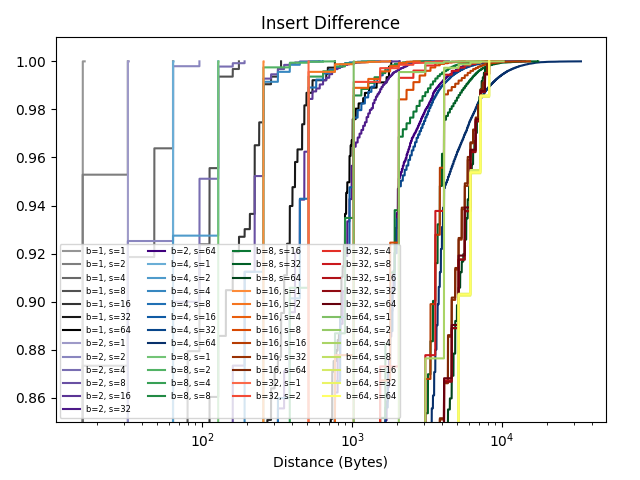
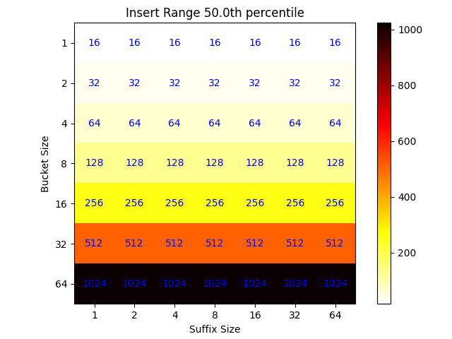
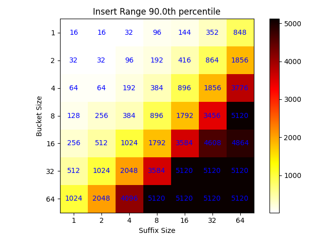
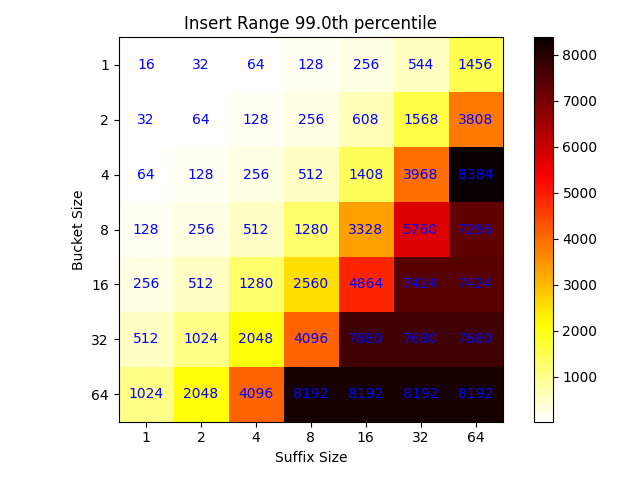

# Introduction

After measuring the read bound, I came to a realization. The range between any
two hash entries also constricts the range on how far cuckoo inserts will reach.
For example if an insert at index 1 has a collision, the chances of it making it
to index 500 on a cuckoo path is lower than index 5 (assuming we have a bound
smaller than 500). 

This has some potential advantages if true. The first of which is that the most
expensive operation I can think of will be iteratively searching through a hash
index to determine how to construct a cuckoo path. Each read would require a
round trip.

Consider instead an alternative where a client which knows that with 99%
certainty a read of size x will provide enough information to construct a path.
In this case the client can read, construct a path locally, and then attempt to
execute the path iteratively to remote memory. I think that despite the fact
that this will go stale, it is still a much better approach than acting on
remote memory entirely. 

There are also good search strategies which could improve the ability of a local
client to find a suitable location within bounded memory
[http://www.cs.cmu.edu/~dga/papers/cuckoo-eurosys14.pdf](Algorithmic Improvement
for fast concurrent cuckoo Hashing), Figure 4 shows the BFS version of cuckoo
path insertion. Given that we could grab a chunk of the table, using a random
search with may bounce out of the range seems a little silly. We could grab a
chunk and then do the ** best we can ** to fit the search into that location.
While it may not be possible, and a second retrieval may be in order, we can
still likely get a boost in performance here.

# Experiments

I ran my insertion experiments on a variety of bounds, and bucket sizes. Each
time that an insert happened on a random path, I captured the entire path. I then
measured all of the gaps, taking into account wrapping around the edge of the
table, and collected a max min on the insert which produced a single range. The
range is the amount of memory in distance that would have to be read in a single
shot if all of the access were to be made local.

I've plotted a general CDF of each of the conditions and made 3 heat maps at
different percentiles. Each Run was 128 experiments.

