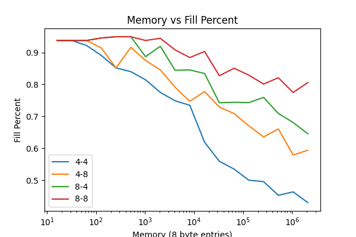
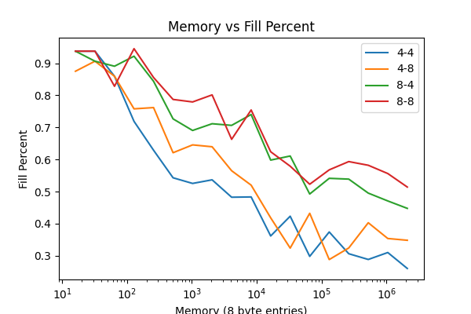

# Introduction

Today is not the best start to the day. I decided to see what happened if I made the table size bigger, and this happened.

Here the x-y in the legend is bucket size-suffix size. The real takeaway from this is that BFS starts to do worse with the bound as the table gets larger.

My first instinct here is that because I've bounded the search, I am more likely to run into a cluster of values that stops me sooner. I think that my next step is to deepen the search and then try again with 4-4. In this first experiment the depth of search is set to 3 for speed.

Actually perhaps I'll try dfs again and see if it holds up. If not I might be hosed.

Even Worse. I went back to the dfs variant because I assumed that it would be
able to probe deeper into the table, but it seems that I was wrong. In this case the performance is even worse than I would have expected.

The next step is to keep using DFS but to increase the search depth and see if that helps the results. Recall that the value used in the algorithmic improvements to cuckoo hash paper was 5.
