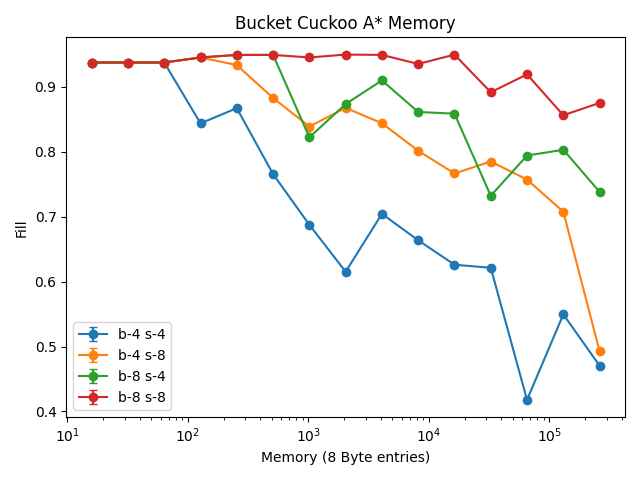
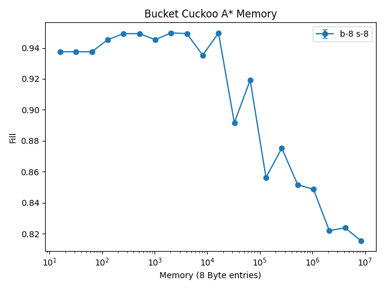

# Introduction

BFS is very slow and requires a huge amount of memory to find the shortest path. Becasue of the table experiments I figured that a better search could give me good results without taking years to run.

In the case of traditional cuckoo they are doomed to use BFS because each of the hash locations is random. I however the bounded hash restricts the distance that a cuckcoo walk can travel. Because of this I actually have a heuristic which gives me a good idea about how far away a cuckoo walk is from reaching its destination.

Because of this I decided to use A* to try to find optimal shortest path. It looks like dfs except that stage 1 is to just read the hash table in order to find the closest location with an empty slot. Then the search is performed to try and find a path to that location. If there is no path to the first location I try again for the next location. I've set the bound on the number of searches to 8.

It does appear to do a bit better than BFS. It's not clear to me though that this has anything to do with A*. I actually think that what is happening is that with a particular suffix size and bound size there is a probability of reaching a blocking point. i.e a point where many of the same entries point to the same table. In these cases the degrees of freedom of the search seem to start failing. It would be an interesting thing to measure next in order to understand when we reach stopping critera.

I ran the 8 bound 8 suffix experiment way out to a few million elements. Falling
to an 80% fill rate is not great at all. I think that I'll still need to have
some sort of innovation here in order to make this work.
