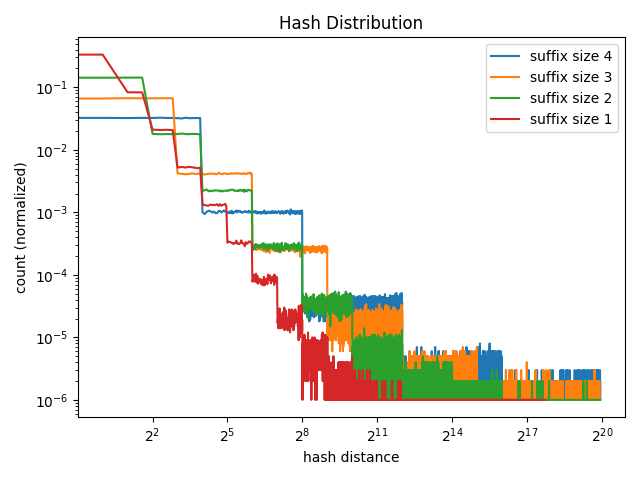
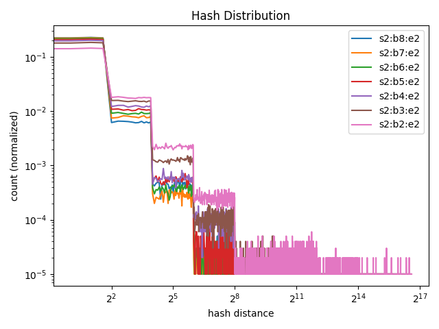
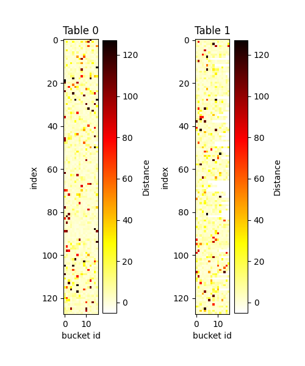
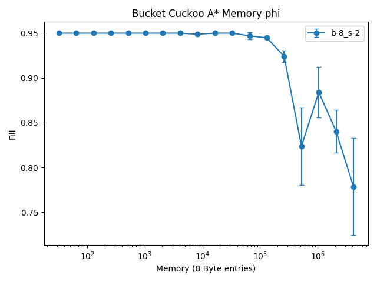
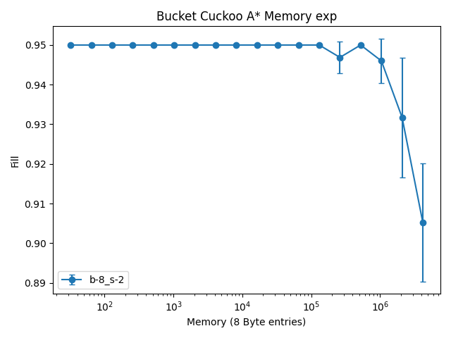
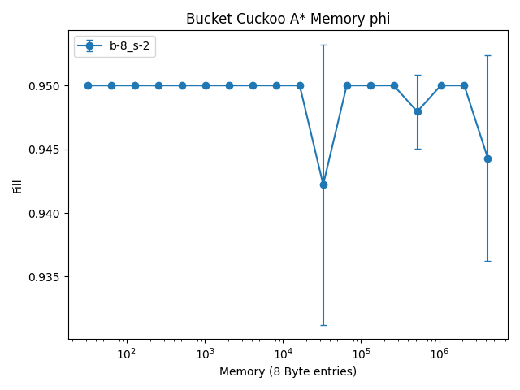
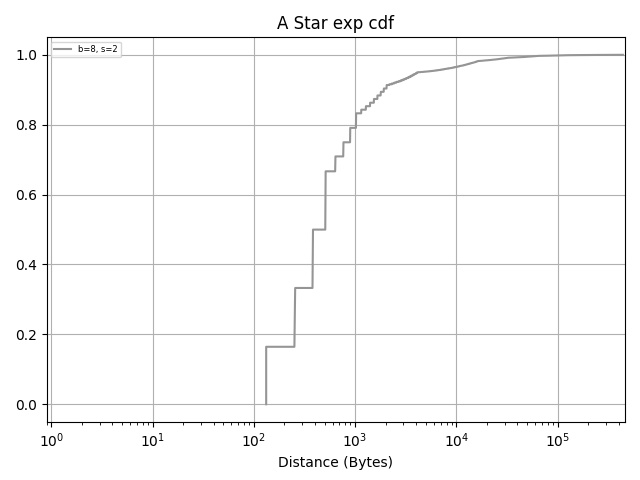

# Introduction

Dangerous times. It seems that as I scale out the hash table any configuration of suffix and bucket eventually crashes. I had an idea to try and mitigate this. If in the static case where the bound on each suffix is constant we run in to "knots" point in the hashing where we have no option but to stop, perhaps putting a few items in the hash which can cause the hash to jump out of the region and into another one. 

The idea is to put the suffix size on an exponential distribution with a small
mean, but a very long tail. The idea is that when we don't have a very full
table we should at least be able to search for a location that will "eject" us
to another part of the table where we could actually find a solution.

My thoughts on the implementation are that when we have an item with a really be
span (i.e the exponential one) we just issue two reads to find both location
exactly as RACE does. However in the common case we can get away with issuing a
single read

My code at the moment counts the number of zeros generated by the first hash function and uses that to determine how big the suffix of the value is.

```python
def secondary_bounded_location_exp(key, table_size, suffix_size):
    primary = primary_location(key, table_size)
    ps = str(bin(primary))[2:]
    zeros = (len(ps) - len(ps.rstrip('0')) + 1) * suffix_size
    secondary = (int(h2(key),16)) % (2**zeros)
    return (primary + secondary) % table_size
```


I decided to run experiments to show how varying the value of suffix = B^E performed with respect to read distances.

Here is a variance of the exponent E



Also experiments for base B



The exponential table has distances which vary quite a bit from the original bucket suffix configuration. 

I've plotted a distribution of the distances as a table visual using a heatmap.
Here is the base distribution


Here is the exponential distribution


I decided to also run some basic experiments where i checked the fill difference across some of the exponents.





Based on the fill results it seems to me that 2.0 is probably the best to go with at the moment. I took the opprotunity to run the same experiment but collect the distribution of read size as a CDF.




